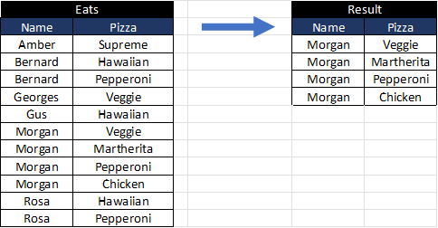
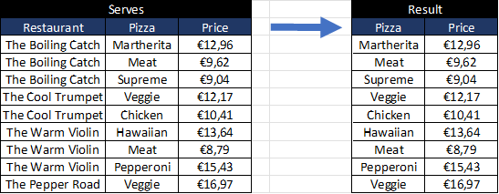
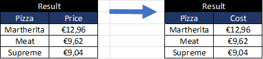
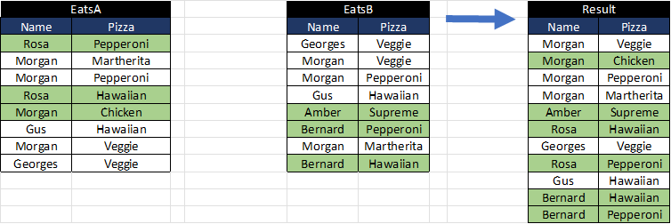
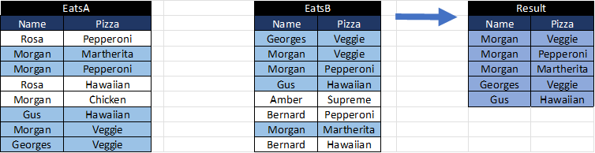
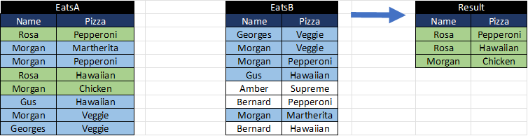
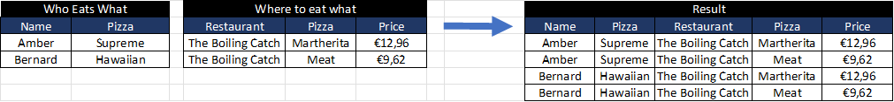
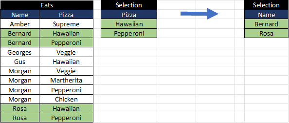
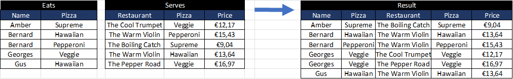

# relational-algebra

A simple and non optimized implementation of relational algebra operators, based on Pandas, to understand better how they work.

## Unary operators :

- **Selection operator**: σ, to filter rows
  - sigma(df: pd.DataFrame, func)
- **Projection operator**: ∏, to select columns
  - pi(df: pd.DataFrame, columns: list) 
- **Renaming operato**: ρ, to change a column name
  - rho(df: pd.DataFrame, current_col_name: str, new_col_name: str)

## Binary operators :

- **Union operator**: ∪, to get A and B elements without duplicates
  - union(dfA: pd.DataFrame, dfB: pd.DataFrame)
- **Intersection operator**: ∩, to get elements which are in A and B
  - intersection(dfA: pd.DataFrame, dfB: pd.DataFrame)
- **Substraction operator**: -, to get elements which are in A and not in B
  - substraction(dfA: pd.DataFrame, dfB: pd.DataFrame)
- **Cartesian product operator**: X, return a combination of all rows of A and B
  - cartesian_product(dfA: pd.DataFrame, dfB: pd.DataFrame)
- **Division  operator**: /, keep values of A that exist in combinaison with all values of B
  - division(dfA, dfB, keyA, keyB)

## Joins:

- **Join**: ⋈, to add columns from another dataframe using a key
  - join(dfA: pd.DataFrame, dfB: pd.DataFrame, key: str)
- **Theta Join**: ⋈θ, to filter a cartesian product on a condition
  - theta_join(dfA, dfB, func)
- **Semi join**: ⋉, keep rows of A when their value of one column are included in a column B
  - semi_join(dfA: pd.DataFrame, dfB: pd.DataFrame, key: str)
- **Antijoin**: ▷, the inverse of a Semi join
  - anti_join(dfA: pd.DataFrame, dfB: pd.DataFrame, key: str)
- **Left Outer Join**: ⟕, join allowing empty values of B
  - left_outer_join(dfA: pd.DataFrame, dfB: pd.DataFrame, key: str)
- **Right Outer Join**: ⟖, join allowing empty values of A
  - right_outer_join(dfA: pd.DataFrame, dfB: pd.DataFrame, key: str)
- **Full Outer Join**: ⟗, join allowing empty values of A and B
  - full_outer_join(dfA: pd.DataFrame, dfB: pd.DataFrame, key: str)

# Documentation

## Selection operator: σ, to filter rows

sigma(Eats, lambda df : df["Name"] == "Morgan)

## Projection operator: ∏, to select columns

- pi(Serves, ["Pizza", "Price])

## Renaming operator: ρ, to change a column name

- rho(Result, "Price", "Cost")

## Union operator: ∪, to get A and B elements without duplicates

- union(EatsA, EatsB)

## Intersection operator: ∩, to get elements which are in A and B

- intersection(EatsA, EatsB)

## Substraction operator: -, to get elements which are in A and not in B

- substraction(EatsA, EatsB)

## Cartesian product operator: X, return a combination of all rows of A and B

- cartesian_product(Eats, Serves)

## Division operator: /, keep values of A that exist in combinaison with all values of B

- division(Eats, Selection, "Name", "Pizza")

## Join: ⋈, to add columns from another dataframe using a key

- join(Eats, Serves, "Pizza")

